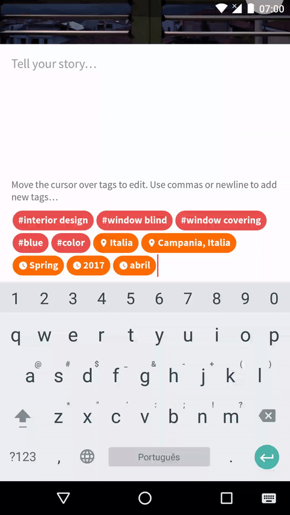
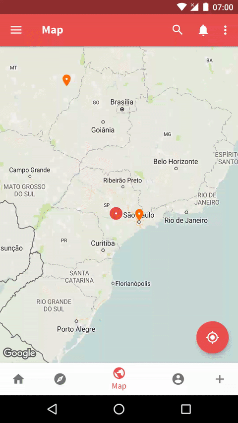

<!-- markdown-preview README.md -->
# Autocomplete

Simple yet powerful autocomplete behavior for `EditText`s, to avoid working with
`MultiAutoCompleteTextView` APIs.

```groovy
compile 'com.otaliastudios:autocomplete:1.0.1'
```

To see it in action, take a look at the sample app in the `sample` module.

<!-- doctoc README.md --github --notitle -->
<!-- START doctoc generated TOC please keep comment here to allow auto update -->
<!-- DON'T EDIT THIS SECTION, INSTEAD RE-RUN doctoc TO UPDATE -->


- [Usage](#usage)
  - [AutocompletePolicy](#autocompletepolicy)
  - [AutocompletePresenter](#autocompletepresenter)
    - [RecyclerViewPresenter](#recyclerviewpresenter)
  - [AutocompleteCallback](#autocompletecallback)
- [Contributing](#contributing)

<!-- END doctoc generated TOC please keep comment here to allow auto update -->

## Usage



`Autocomplete` let's you add autocomplete behavior to any `EditText` of your choice. The workflow is
as follows:

- User types stuff into the edit text
- `AutocompletePolicy` detects if typed text should trigger the autocomplete popup
- If yes, the popup is shown
- `AutocompletePolicy` extracts the **query** string from text. For instance, if text is *Look at 
this @john*, you might want to look for *john* users in your database
- The query string is passed to `AutocompletePresenter`, that shows a list of items for that query
- When some item is clicked, `AutocompleteCallback` is notified and tells whether the popup should be
dismissed or not.

These are the base components of the library. You will build an `Autocomplete` instance passing
each component you need, and that's it.

```java
Autocomplete.on(editText)
  .with(autocompletePolicy)
  .with(autocompleteCallback)
  .with(autocompletePresenter)
  .with(popupBackground)
  .with(popupElevation)
  .build();
```

### AutocompletePolicy

This is an interface that controls when to show/hide the popup. For simple cases (single autocompletion,
with just one result, similar to `AutocompleteTextView`) you can leave this unspecified. The library will
fallback to `Autocomplete.SimplePolicy`:

```java
public class SimplePolicy implements AutocompletePolicy {
    @Override
    public boolean shouldShowPopup(Spannable text, int cursorPos) {
        return text.length() > 0;
    }

    @Override
    public boolean shouldDismissPopup(Spannable text, int cursorPos) {
        return text.length() == 0;
    }

    @Override
    public CharSequence getQuery(Spannable text) {
        return text;
    }

    @Override
    public void onDismiss(Spannable text) {}
}
```

For more complex situations, you can go implementing the methods:

- `shouldShowPopup(Spannable, int)`: called to understand whether the popup should be shown. For
instance, you might want to trigger the popup only when the hashtag character '#' is typed.
- `shouldDismissPopup(Spannable, int)`: whether the popup should be hidden. The typical implementation
would simply be to return `!shouldShowPopup()`, but that is up to you.
- `getQuery(Spannable)`: called to understand which part of the text should be passed to presenters.
For instance, user might have typed *@john* but you want to query for *john* of course.
- `onDismiss(Spannable)`: this is the moment you should clear any span you have added to the text.

For the typical case of `#hashtags`, `@usernames` or whatever is triggered by a certain character,
the library provides the `CharPolicy` class. It works as multi-autocomplete as well (e.g. for texts
like *you should see this @john @pete*).

```java
Autocomplete.on(editText)
  .with(new CharPolicy('#'))
  .with(autocompletePresenter)
  .build();
```

### AutocompletePresenter

The presenter controls the display of items and their filtering when a query is selected.
It is recommended to extend `RecyclerViewPresenter`, which shows a `RecyclerView` list.
For more complex needs, look at the base `AutocompletePresenter` class and its comments.

#### RecyclerViewPresenter

This automatically inflates a `RecyclerView` into the popup. Some relevant callbacks to be overriden:

- `instantiateAdapter()`: you should provide an adapter for the recycler here.
- `instantiateLayoutManager()`: same for the layout manager. Defaults to vertical `LinearLayoutManager`.
Complex managers might lead to UI inconsistencies.
- `getPopupDimensions()`: return dimensions for the popup (width, height, maxWidth, maxHeight).
- `onViewShown()`: you can perform further initialization on the recycler. The list now is about to be requested.
- `onQuery(CharSequence)`: we have a query from the edit text, as returned by `AutocompletePolicy`.
This is the time to display a list of results corresponding to this filter.
- `onViewHidden()`: release resources here if needed.

When a list item is clicked, please ensure you are calling `dispatchClick(item)` to dispatch the
click event to the `AutocompleteCallback`, if present.

### AutocompleteCallback

```java
public interface AutocompleteCallback<T> {
    boolean onPopupItemClicked(Editable editable, T item);
    void onPopupVisibilityChanged(boolean shown);
}
```

`AutocompleteCallback` controls what happens when either the popup visibility changes, or when an
item is selected. Typically at this point you might want to insert a `String` related to that item
into the `EditText`.

This should be done by acting on the `Editable` interface that you should already know, using 
methods like `editable.insert()` or `editable.replace()`.

## Contributing

You are welcome to contribute with issues, PRs or suggestions.